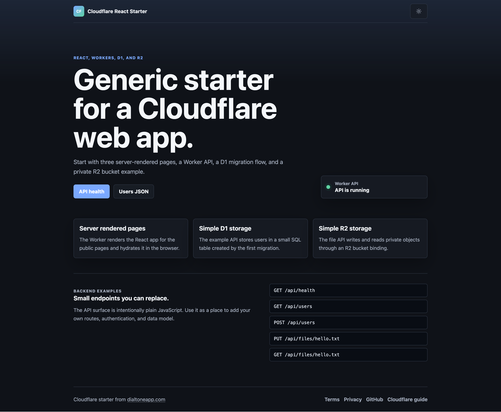
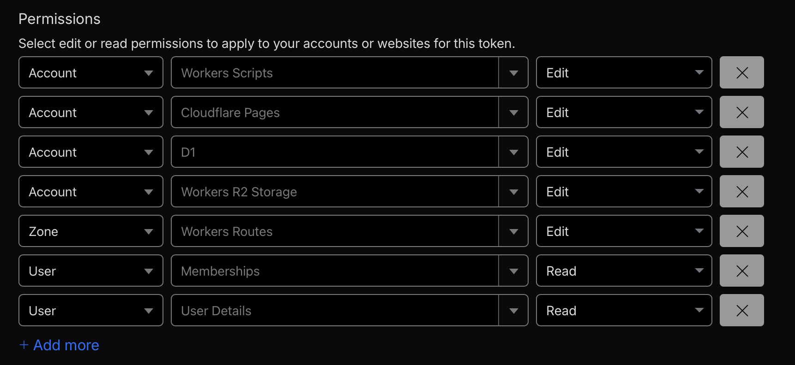

# Cloudflare React Starter

A small starter for shipping a React app on Cloudflare Workers. It includes:

- React pages rendered by the Worker for `/`, `/terms`, and `/privacy`
- A Worker API under `/api/*`
- D1 with a sample `users` table and migration runner
- R2 with simple private object read/write examples
- A default `workers.dev` deploy path, plus a custom domain example

This is meant to be copied into a new project, renamed, and deployed with one Cloudflare API token.



## Copy Into a New Project

From this repo, copy only the app files:

```sh
mkdir -p ../new-project && cp -R wrangler.jsonc .gitignore .env.example vite.config.js package.json worker src scripts migrations ../new-project/
```

Then in the new project:

```sh
npm install
```

## Project Layout

```text
src/                  React app, SSR entry, shared route metadata
worker/               Cloudflare Worker backend and API routes
migrations/           D1 SQL migrations
scripts/              Local and remote migration/dev helpers
wrangler.jsonc        Worker, assets, D1, R2, and routing config
```

## Local Development

Run the Vite frontend and local Worker API together:

```sh
npm run dev
```

Open `http://localhost:5173`. Vite proxies `/api/*` to Wrangler at `http://localhost:8787`.

For a closer production-style local run where the Worker serves SSR and assets:

```sh
npm run worker
```

Open `http://localhost:8787`.

## Deploy From a Fresh Cloudflare Account

These steps work on the Cloudflare free plan. Wrangler can deploy with the API token from `.env`.

1. Create a Cloudflare account at `https://dash.cloudflare.com`.

2. Create an API token.

   In Cloudflare, open **My Profile > API Tokens > Create Token > Custom token**.

   Add these permissions for the account and zone you are deploying to:

   - `Account > Workers Scripts: Edit`
   - `Account > Cloudflare Pages: Edit`
   - `Account > D1: Edit`
   - `Account > Workers R2 Storage: Edit`
   - `Zone > Workers Routes: Edit`
   - `User > Memberships: Read`
   - `User > User Details: Read`

   If you will only deploy to `workers.dev`, `Zone > Workers Routes: Edit` is not used, but it is needed once you switch to a custom domain.

   

3. Put the token in `.env`.

   ```sh
   cp .env.example .env
   ```

   Edit `.env` so it contains:

   ```sh
   CLOUDFLARE_API_TOKEN=your-api-token
   ```

4. Rename the Worker.

   In `wrangler.jsonc`, change:

   ```jsonc
   "name": "cloudflare-react-starter"
   ```

   to your app name, for example:

   ```jsonc
   "name": "my-app"
   ```

5. Create the D1 database.

   The starter expects the database name to be `main`, which keeps the migration script simple:

   ```sh
   npx wrangler d1 create main
   ```

   Copy the `database_id` from Wrangler's output into `wrangler.jsonc`, replacing:

   ```jsonc
   "database_id": "00000000-0000-0000-0000-000000000000"
   ```

6. Create the R2 bucket.

   Pick a bucket name for the app and environment. A good pattern is `<app-name>-prod`, for example `my-app-prod`.

   ```sh
   npx wrangler r2 bucket create my-app-prod
   ```

   Then update `bucket_name` in `wrangler.jsonc`:

   ```jsonc
   "bucket_name": "my-app-prod"
   ```

   If Cloudflare asks you to enable R2 in the dashboard first, enable it and rerun the command.

7. Apply the remote D1 migration.

   ```sh
   npm run migrate:remote
   ```

8. Deploy.

   ```sh
   npm run deploy
   ```

9. Test the deployed app.

   If you are using the default `workers.dev` route:

   ```sh
   export APP_URL="https://my-app.<your-workers-subdomain>.workers.dev"
   ```

   Then:

   ```sh
   curl "$APP_URL/api/health"
   curl "$APP_URL/terms"
   curl "$APP_URL/privacy"
   ```

## Custom Domain

The starter uses `workers_dev` by default:

```jsonc
"workers_dev": true
```

For a custom domain, remove `workers_dev` and add routes like this near the end of `wrangler.jsonc`:

```jsonc
"routes": [
  {
    "pattern": "example.com/*",
    "zone_name": "example.com"
  },
  {
    "pattern": "example.com",
    "zone_name": "example.com",
    "custom_domain": true
  }
],
"placement": {
  "mode": "smart"
}
```

Replace `example.com` with a zone already added to your Cloudflare account.

## API Examples

Local examples after `npm run dev` or `npm run worker`:

```sh
curl http://localhost:8787/api/health

curl -X POST http://localhost:8787/api/users \
  -H "Content-Type: application/json" \
  -d '{"email":"person@example.com","name":"Example Person"}'

curl http://localhost:8787/api/users

curl -X PUT http://localhost:8787/api/files/hello.txt \
  -H "Content-Type: text/plain" \
  --data "Hello from R2"

curl http://localhost:8787/api/files/hello.txt
```

## Migrations

The migration runner tracks applied SQL files in `schema_migrations`.

Run local migrations:

```sh
npm run migrate:local
```

Run remote migrations:

```sh
npm run migrate:remote
```

The first migration, `migrations/001_init.sql`, creates:

```sql
users (
  id TEXT PRIMARY KEY,
  email TEXT NOT NULL UNIQUE,
  name TEXT NOT NULL,
  created_at TEXT NOT NULL
)
```

If you use a database name other than `main`, either update `wrangler.jsonc` and run migrations with `D1_DATABASE=your-db-name`, or pass the database name directly:

```sh
npm run migrate:remote -- --db your-db-name
```

## Useful References

- Cloudflare Workers `workers.dev`: https://developers.cloudflare.com/workers/configuration/routing/workers-dev/
- Wrangler configuration: https://developers.cloudflare.com/workers/wrangler/configuration/
- D1 migrations: https://developers.cloudflare.com/d1/reference/migrations/
- R2 bucket creation: https://developers.cloudflare.com/r2/buckets/create-buckets/
- API token creation: https://developers.cloudflare.com/fundamentals/api/get-started/create-token/
- API token permissions: https://developers.cloudflare.com/fundamentals/api/reference/permissions/
